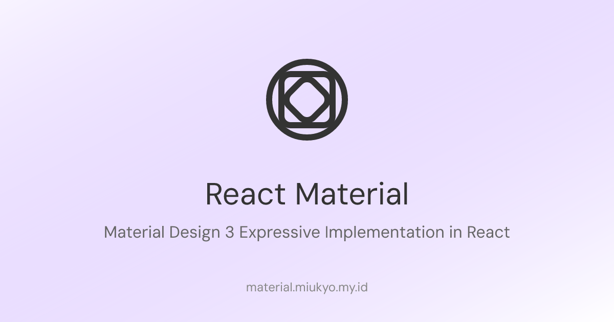

React Material is a React component library built on the principles of Google's Material 3 design language. It provides a comprehensive set of UI components that are both visually appealing and highly functional, enabling developers to create consistent and accessible user interfaces with ease.

> **Note**: React Material is an unofficial project and is not affiliated with or endorsed by Google. It is independently developed to bring the Material 3 design language to React applications.

## Documentation

For full documentation, including a list of all components and their props, please visit our documentation website:

[**Explore the docs**](https://material.miukyo.my.id)

## Why React Material?

- **Material 3 Design**: All components are designed to align with Google's latest Material 3 guidelines, ensuring a cohesive and modern look and feel.
- **Customizable**: Easily customize components to match your application's branding and design requirements.
- **Accessible**: Accessibility is a core focus, ensuring that your applications are usable by everyone.
- **Developer-Friendly**: With detailed documentation and intuitive APIs, React Material makes it easy to integrate and use components in your projects.

## License

This project is licensed under the Apache-2.0 License. See the [LICENSE](LICENSE) file for details.

